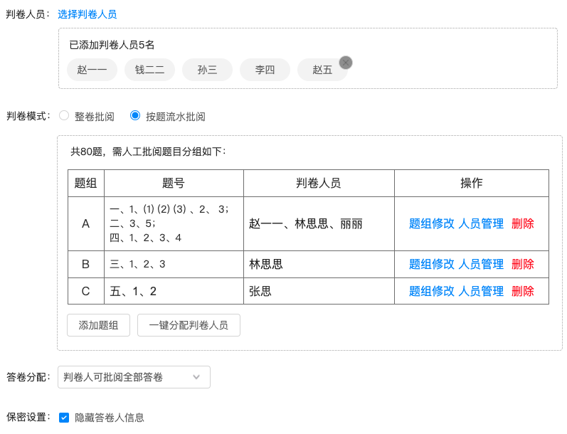

# 基于 constate 的状态管理 - 复杂场景

我们在这节将通过一个更复杂的业务场景，设计我们的数据结构。

## 业务场景

这是一个试卷批阅的设置表单，试卷的题目需要和教师一一绑定，用于确定教师批阅的题目集合，并预先分配。




首先，用户需要预选几个教师（判卷人员），然后在题组表格中，勾选试卷的部分题目加入题组；再从预选的教师中，勾选教师加入题组。（勾选的界面可以自己脑补😜）


这时候我们可以确定出几个关键数据：

1. 试卷对应的配置，也就是整个表单 `FormData`
2. 教师基础数据 `Teacher`
3. 当前被设置的试卷 `Paper` ，以及试卷内的题目信息  `PaperQuestion`
4. 然后是表单内包含的题组，`BindGroup`


以及对应的类型声明:

```ts
type FormData = {
  teachers: Teacher[]
  reviewMode
  bindGroup: BindGroup[]
  ...
}
  
type Teacher = {...}
type Paper = { id, name, questions: PaperQuestion[] }
type PaperQuestion = { id, type, content, answer, score }
type BindGroup = { questionKeys: number[], teacherKeys: number[] }
```


## 分层和规划

因为是基于 constate，也就是 Context API，所以基本的设计思路更像是做组件分层。

我们从依赖关系的最外层开始，定义数据层：

### FormDataProvider

试卷配置的表单，提供表单数据和提交相关方法

```tsx
export {FormDataProvider, useFormDataContext} = constate(() => {
  const [markingSettingFormData] = useState<MarkingSettingFormData>()
  async function fetchFormData() {...}
  async function submit() {...}
})
```

### PaperProvider

提供试卷、题目的基础数据

```tsx
export {PaperProvider, usePaperContext} = constate(() => {
	const [paper] = useState<Paper>()
	const [paperQuestions] = useState<PaperQuestion[]>()
	async function fetchPaper() {...}
})
```

### BindGroupProvider

表单内的题组数据，从表单数据层抽离出来，单独维护。同时维护教师绑定对话框和题目绑定对话框的逻辑

```tsx
export {BindGroupProvider, useBindGroupContext} = constate(() => {
	const [bindGroup] = useState<BindGroup[]>()
  function setBindGroupFromFormData(formData: MarkingSettingFormData) {...}
  
  //添加一行空记录
  function add() {...}
  //添加教师到指定记录
  function bindTeachers(index, teachers: Teacher[]) {}
  //添加题目到指定记录
  function bindQuestions(index, questions: PaperQuestion[]) {}
  
  const [teacherSelectVisible] = useState(false)
  function onTeacherSelectOpen() {...}
  function onTeacherSelectConfirm(teachers: Teacher[]) {
    bindTeachers(currentIndex, teachers)
  }
  
  const [questionSelectVisible] = useState(false)
  function onQuestionSelectOpen() {...}
  function onQuestionSelectConfirm(questions: PaperQuestion[]) {
    bindQuestions(currentIndex, questions)
  }
})
```

### Initializer

最后一层是负责初始化的工具组件，聚合上面几个数据层

```tsx
export const Initializer = () => {
  const [loading, setLoading] = useState(false)
  
  const {markingSettingFormData, fetchFormData} = useFormDataContext()
  const {paper, fetchPaper} = usePaperContext()
  const {setBindGroupFromFormData} = useBindGroupContext()
  
  useEffect(() => {
    fetchFormData()
    fetchPaper()
  }, [])
  
  useEffect(() => {
    setLoading(markingSettingFormData && paper)
  }, [markingSettingFormData, paper])
  
  useEffect(() => {
    if (!loading) {
      // 手动初始化 BindGroup
      setBindGroupFromFormData(paper, markingSettingFormData)
    }
  }, [loading])
  
  return loading ? <Loading/> : <Form>
}
```


如果所有这些组件组合起来，应该是这样的：

```tsx
<Page>
  <FormDataProvider>
  	<PaperProvider>
    	<BindGroupProvider>

        <Initializer>
          <MarkingSettingForm />
        </Initializer>
        
        <BindGroupTeacherSelectDialog />
        <BindGroupQuestionSelectDialog />
        
      </BindGroupProvider>
    </PaperProvider>
  </FormDataProvider>
</Page>
```


实际情况下，在 React DevTools 里面看到的组件树会比这个复杂一些


## 总结

基于 constate 或者说是 Context 来实现数据分层，有别于 Redux 的中心化和扁平化，而是更符合直觉一些的树形结构：

- Context 符合 React 的组件规范，在调试工具中天然具备调试和查看数据的能力
- 从可视化的角度来看，树形的数据层次结构更能体现出层级间上下的依赖关系。
- 数据分层能够更灵活的控制数据层的粒度，实现数据层的复用。


